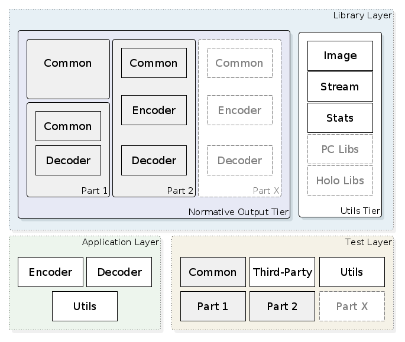

JPEG Pleno Model RC
===

[TOC]

# Part 4, Reference software

Provides reference implementations for the standardized technologies within the JPEG Pleno framework for purpose of reference for prospective implementers of the standard and compliance testing.

# Scope of the project

The aim is to be recognized by ISO/IEC as JPEG Pleno Reference Software (JPEG Pleno Part 4).

# JPEG Pleno

JPEG Pleno aims to provide a standard framework for representing new imaging modalities, such as texture-plus-depth, [light field](https://jpeg.org/jpegpleno/lightfield.html), [point cloud](https://jpeg.org/jpegpleno/pointcloud.html), and [holographic imaging](https://jpeg.org/jpegpleno/holography.html). Such imaging should be understood as light representations inspired by the plenoptic function, regardless of which model captured or created all or part of the content. [Read more](https://jpeg.org/jpegpleno/index.html)

# Licence

[![badge-license]][link-license]


# Prerequisites

- Compiler
  - Tested with gcc 9. Must support C++ 17.
- Cmake
  - Minimum version: 3.10
- latex (optional)
  - Latex is required for generating the documentation.
- Doxygen
  - Tested with version 1.8.13

# Quickstart

After building this project, you can use the provided software to encode and decode plenoptic images. 


## Build instructions

  ```bash
  ~$ mkdir -p jplm  
  ~$ cd jplm  
  ~/jplm/$ mkdir build; cd build  
  ~/jplm/build/$ cmake ..  
  ~/jplm/build/$ make -j  
  ```  


### External Library dependencies

JPLM depends of the external libraries mentioned in [NOTICES.md](NOTICES.md) file.
All dependencies are resolved during the building stage. The only exception is the X11 libraries.
X11 is needed for building the lightfield visualization tool. The compilation will fail if X11 is not present in the system. 
To install X11 libraries (must run as sudo):
  ```bash
  ~$ sudo apt install libx11-*
  ```  

It is possible to skip X11 library install and to avoid failing compilation by disabling the light field visualization tool.
Building of light field visualization tool can be disabled by adding `-DVISUALIZATION_TOOL=OFF` in `cmake` command, i.e.:
  ```bash
  ~/jplm/build/$ cmake -DVISUALIZATION_TOOL=OFF ..
  ```  


### Testing instructions

  ```bash
  ~/jplm/build/$ ctest
  ```  
  
###  Other usefull commands

The following commands can be useful for checking whether buiding is successfull or for development purposes.

### Colorfull output
```bash
  ~/jplm/build/$ export GTEST_COLOR=1
  ```

### To show all tests
```bash
  ~/jplm/build/$ ctest --verbose
  ```
or the alternative on Windows Powershell
```powershell
Get-ChildItem "..\bin-debug\tests\" -Filter *_tests.exe | Foreach-Object { Start-Process -NoNewWindow -PassThru -Wait $_.Fullname -ArgumentList "../resources" }
```

### To run again only failed tests

```bash
  ~/jplm/build/$ ctest --verbose --rerun-failed
  ```


## Steps to Encode Light Field Data (Part 2)

Using the JPEG Pleno dataset as reference, the steps for encoding a light field consist of (1) adjust input views to a valid format name and with homogeneous luminance for all views, (2) convert views from PPM to PGX image format, and (3) run the encoder with the parameters.

### Shift Input Views Filenames and Adjust Brightness

If the encoded light field is of a 'lenslet' type of JPEG Pleno database, the views must be renamed to start at 000_000. The border views of 'lenslet' datasets must to be brighten because they are too dark. The dataset can be prepared for encoding via `bin/utils/lenslet_13x13_shifter` tool. 

Example:
  ```bash
  ORIGINALS_INPUT_PATH="/home/RAW/TAU/I01_Bikes/"  
  ORIGINAL_TEMPORARY_PATH="/home/RAW/TAU/I01_Bikes_shifted/"  
  JPLM_BINS="/home/jpeg-pleno/jplm/bin"  

  ${JPLM_BINS}/utils/lenslet_13x13_shifter ${ORIGINALS_INPUT_PATH} ${ORIGINAL_TEMPORARY_PATH} encoder
  ```  

### Convert Views to PGX Image Format

Example:
  ```bash
  ORIGINAL_TEMPORARY_PATH="/home/RAW/TAU/I01_Bikes_shifted/"  
  CONVERTED_PGX_PATH="/home/RAW/TAU/I01_Bikes_shifted_PGX/"  
  JPLM_BINS="/home/jpeg-pleno/jplm/bin"  

  for i in ${ORIGINAL_TEMPORARY_PATH}/*;  
  do  
    ${JPLM_BINS}/utils/convert_ppm_to_pgx -i $i -o ${CONVERTED_PGX_PATH};  
  done  
  ```  

### Run the Encoder

Example:
  ```bash
  CONVERTED_PGX_PATH="/home/RAW/TAU/I01_Bikes_shifted_PGX/"
  JPLM_BINS="/home/jpeg-pleno/jplm/bin"
  OUTPUT_JPL_FILE=/home/RAW/I01_Bikes.jpl

  ${JPLM_BINS}/jpl-encoder-bin --show-progress-bar --show-runtime-statistics --part 2  \  
      --type 0 --enum-cs YCbCr_2 -u 625 -v 434 -t 13 -s 13 -nc 3 --show-error-estimate \  
      --border_policy 1 --lambda 10000 --transform_size_maximum_inter_view_vertical 13 \  
      --transform_size_maximum_inter_view_horizontal 13                                \  
      --transform_size_maximum_intra_view_vertical 31                                  \  
      --transform_size_maximum_intra_view_horizontal 31                                \  
      --transform_size_minimum_inter_view_vertical 13                                  \  
      --transform_size_minimum_inter_view_horizontal 13                                \  
      --transform_size_minimum_intra_view_vertical 4                                   \  
      --transform_size_minimum_intra_view_horizontal 4                                 \  
      --input ${CONVERTED_PGX_PATH} --output ${OUTPUT_JPL_FILE}
  ```  


## Steps to Decode a JPL file


  ```bash
  INPUT_JPL_FILE="/home/RAW/I01_Bikes.jpl"  
  OUTPUT_DIRECTORY"=/home/DECODED/I01_Bikes"  
  JPLM_BINS="/home/jpeg-pleno/jplm/bin"  

  ${JPLM_BINS}/jpl-decoder-bin --input ${INPUT_JPL_FILE} --output ${OUTPUT_DIRECTORY}
  ```  


## Architecture overview




## Directory layout
The directories and modules are organized similarly to the architecture.
See [docs/diagrams/PacketDiagram.pdf](docs/diagrams/PacketDiagram.pdf) for more details.

- JPLM
  - *bin*
    - *tests*
    - *utils*
  - *build*
  - cfg
    - part2
      - 4DPredictionMode
        - greek
        - I01_Bikes
        - I02_Danger_de_Mort
        - I04_Stone_Pillars_Outside
        - I09_Fountain_Vincent_2
        - img1
        - img2
        - img3
        - poznanlab1
        - set2
        - sideboard
        - tarot
      - 4DTransformMode
        - Bikes
  - cmake
  - doc
    - diagrams
  - *lib*
  - resources
    - boxes
      - invalid
    - markers
    - pgx_tests
    - pixmap_exceptions
      - not_regular_file
    - rgb_pattern
    - small_greek
  - source
    - App
      - Common
      - Encoder
      - Decoder
    - Lib
      - Part1
        - Common
        - Encoder
        - Decoder
      - Part2
        - Common
        - Encoder
        - Decoder
      - PartX
        - Common
        - Encoder
        - Decoder

The above directories highlighted in *italic* are created after the building process.

##  Citation

If you use this code for your research, please cite our paper.

```
@inproceedings{plenoConformanceAndReferenceSW2020,
  author = {Cristian Perra and Pedro Garcia Freitas and Ismael Seidel and Peter Schelkens},
  title = {{An overview of the emerging JPEG Pleno standard, conformance testing and reference software}},
  volume = {11353},
  booktitle = {Optics, Photonics and Digital Technologies for Imaging Applications VI},
  editor = {Peter Schelkens and Tomasz Kozacki},
  organization = {International Society for Optics and Photonics},
  publisher = {SPIE},
  pages = {207 -- 219},
  keywords = {JPEG Pleno, Conformance testing, Reference software, Compression, Standard, Light field, Point cloud, Holography},
  year = {2020},
  doi = {10.1117/12.2555841},
  URL = {https://doi.org/10.1117/12.2555841}
}
```

##  Contributing 

Bug fixes, improvements, and more contributions are welcome. Information on how to get started can be found at [CONTRIBUTING.md](CONTRIBUTING.md).

# Known issues and limitations 

Initially, only Lightfield images are supported in JPLM (JPEG Pleno Model).


[badge-license]: https://img.shields.io/badge/license-BSD--3--Clause-blue.svg "BSD 3-clause license"
[link-license]: https://gitlab.com/smtlightfieldsteam/jplm/blob/master/LICENSE.md "BSD 3-clause license"
